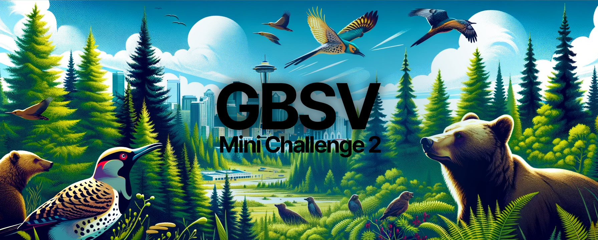

# gbsv - Mini Challenge 2
This repository contains all my work related to **gbsv's Mini-Challenge 2** in the **fall semester of 2023**.

**Explored Contents**:
- Autocorrelation
- Cross-Correlation
- Thresholding-Based Segmentation
- Color-Based Segmentation
- Keypoint Matching with Histogram of Oriented Gradients

Module: [gbsv](https://spaces.technik.fhnw.ch/spaces/grundlagen-der-bild-und-signalverarbeitung)